# <center>福建水利电力职业技术学院自动疫情填报 V1.0 (完全自动)</center>
<center><font size=150 color="red">使用前请务必查看申明部分</font></center>
# 简介

福建水利电力职业技术学院自动完成学生健康情况填报、每日健康监测。

此源码为 [【安徽科技学院自动疫情填报】](https://github.com/jiongjiongJOJO/AHSTU_SPCP_2) 项目修改而来， 接口大致几乎一样，只是增加了很多数据校验。

此版本只需要之前手动填报过信息，就会获取之前的信息进行自动提交。

开源不易，如果本项目对你有帮助，那么就请给个star吧。😄

同时，欢迎各位老板在线打赏。下面是我的要饭码！

[在线打赏](https://raw.githubusercontent.com/jiongjiongJOJO/FJDXY_SPCP/master/img/0.jpg)

# 目录

- [简介](#简介)
- [目录](#目录)
- [更新日志](#更新日志)
- [功能](#功能)
- [准备数据](#准备数据)
    - [user、password](#userpassword)
    - [OCR_ak、OCR_sk](#ocr-akocr-sk)
    - [send_key（可选）](#send-key可选)
- [使用方式](#使用方式)
    - [Github Actions](#github-actions)
        - [fork本项目](#fork本项目)
        - [准备需要的参数](#准备需要的参数)
        - [将参数填到Secrets](#将参数填到secrets)
        - [开启Actions](#开启actions)
        - [补充说明](#补充说明)
    - [腾讯云函数](#腾讯云函数)
        - [新建一个函数](#新建一个函数)
        - [执行部署脚本](#执行部署脚本)
        - [修改相关参数](#修改相关参数)
        - [设置自动运行](#设置自动运行)
- [申明](#申明)

# 更新日志

**V1.0** - 2021年02月18日（可能是更早，忘记了）

```
创建FJDXY_SPCP项目并开源
```

# 功能

* [X]  自动填报三次随机体温（36.0~36.9）
* [X]  自动填报学生健康情况
* [X]  填报失败后会微信推送到消息

# 准备数据 

后面提到的字段的描述如下：

|  字段名  |  是否必填  |  描述  |
|  ----  |  ----  |  ----  |
|  user  |  ✔  | 你的学号（疫情填报登陆账号）  |
|  password  |  ✔  |  你疫情填报系统的密码  |
|  OCR_ak  |  ✔  |  百度云访问密钥ID(Access Key Id, 简称AK)  |
|  OCR_sk  |  ✔  |  百度云秘密访问密钥(Secret Access Key, 简称SK)  |
|  send_key  |  ❌  |  PushPlus的token  |

*这里的【百度云】是指百度云计算，不是百度网盘，请明确两者的区别*

user和password这里是自己的信息，直接填写就行了。send_key的获取方式如下：

#### user、password
这两个是个人的信息，无需获取，直接填写即可

#### OCR_ak、OCR_sk
首先登录百度云[管理控制台](https://login.bce.baidu.com/?account=&redirect=http://console.bce.baidu.com/) （https://login.bce.baidu.com/?account=&redirect=http://console.bce.baidu.com/） ，点击“用户账号->安全认证”进入Access Key管理界面。
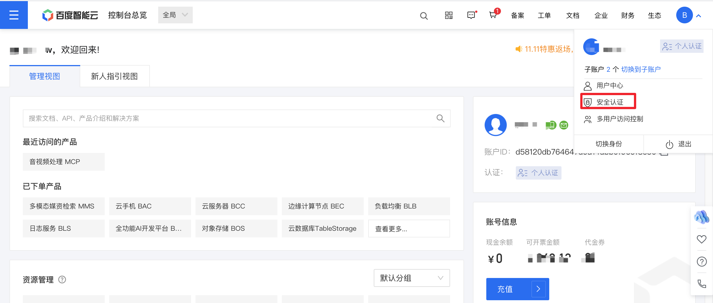

点击Access Key ID右侧的“显示”，可查看其对应的Secret Access Key，点击“隐藏”可隐藏对应的Secret Access Key。

在密钥列表页中，根据需要可点击“创建Access Key”来创建新的Access Key ID / Secret Access Key密钥对。

一个用户最多创建20对Access Key，可通过点击“删除”来删除多余的Access Key。

其中Access Key对应OCR_ak，Secret Key对应OCR_sk。

#### send_key（可选）
首先打开[PushPlus官网:https://www.pushplus.plus/](https://www.pushplus.plus/),然后点击登录，使用自己的微信扫码关注公众号就可以登陆成功
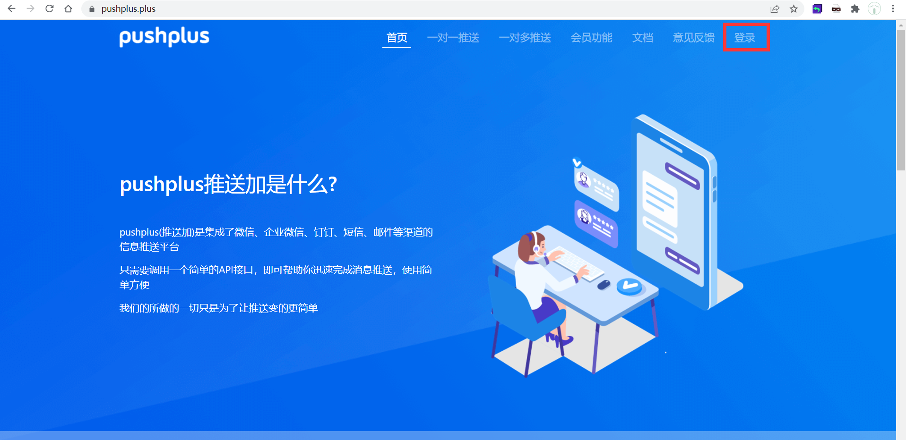

接着点击【一对一推送】，点击一键复制即可

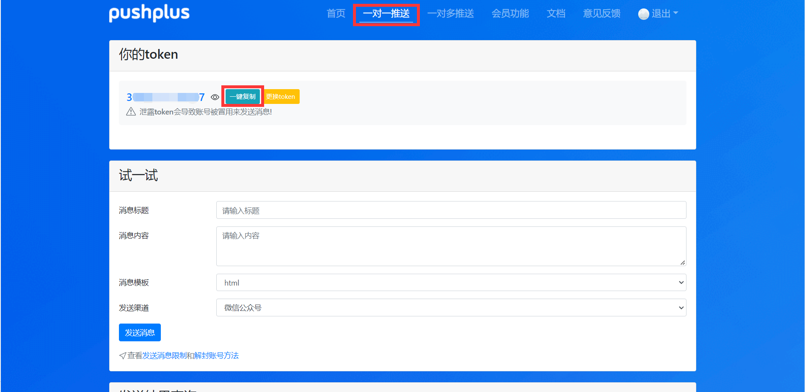


# 使用方式

## Github Actions
github actions自动运行的延迟很高，可能会晚好几个小时，如果对运行时间要求比较高，请放弃使用此方式。
### fork本项目

项目地址：[jiongjiongJOJO/FJDXY_SPCP](https://github.com/jiongjiongJOJO/FJDXY_SPCP)
点击右上角Fork按钮，将项目fork到自己的仓库。

### 准备需要的参数

按照以下格式填写获取到的参数：
```json
{
        "user": "012",
        "password": "345",
        "OCR_ak": "678",
        "OCR_sk": "9ab",
        "send_key": "cde"
}
```

### 将参数填到Secrets

首先打开Secrets页面，如下图操作
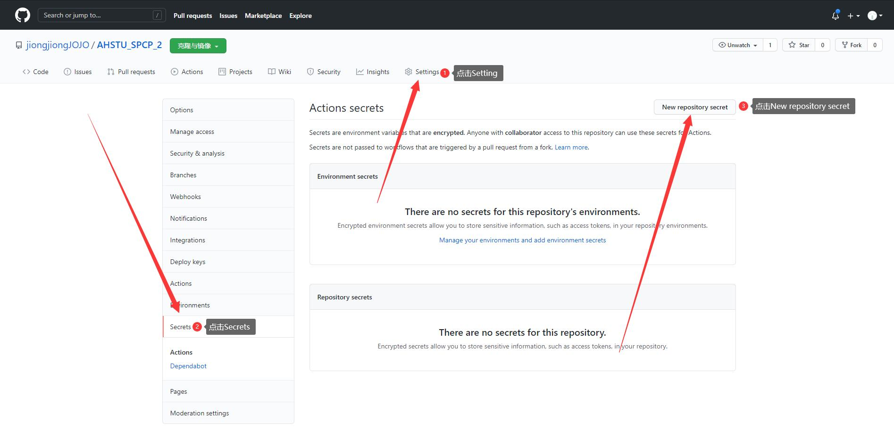

Name填写为“USERINFO"即可

Value填入上一步准备好的参数（图片仅供参考）

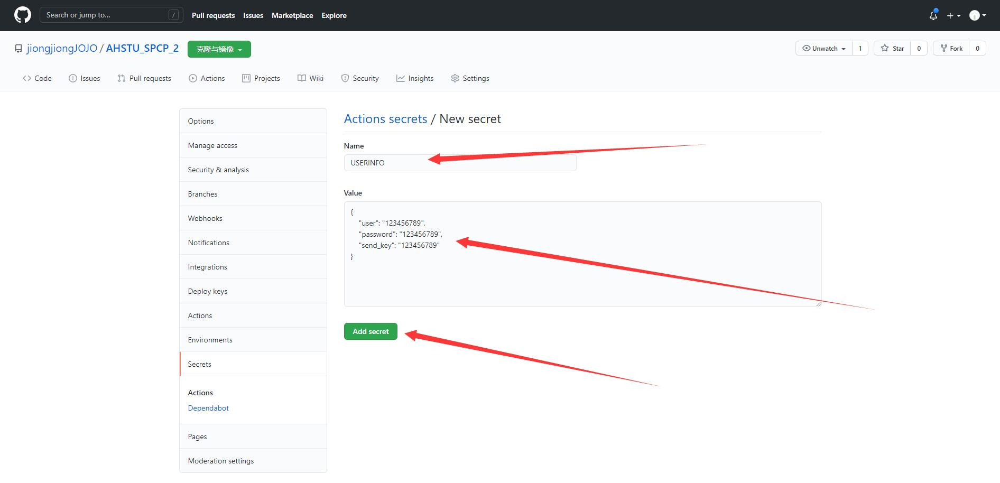

### 开启Actions

默认`Actions`处于禁止状态，在`Actions`选项中开启`Actions`功能，把那个绿色的长按钮点一下。如果看到左侧工作流上有黄色`!`号，还需继续开启。

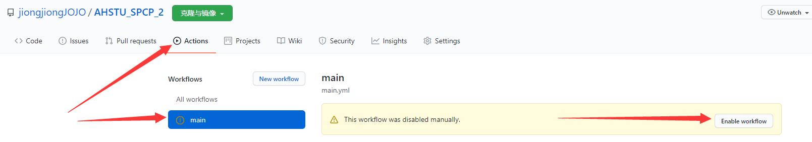

### 补充说明

github 如果超过30天不进行更新项目，github action就会自动禁用，需要根据发送给你的邮件提示或github action页面重新启用工作流。

## 腾讯云函数

### 新建一个函数

打开[腾讯云函数](https://console.cloud.tencent.com/scf/list)，登录账号（可以用QQ登录），然后点击“新建”
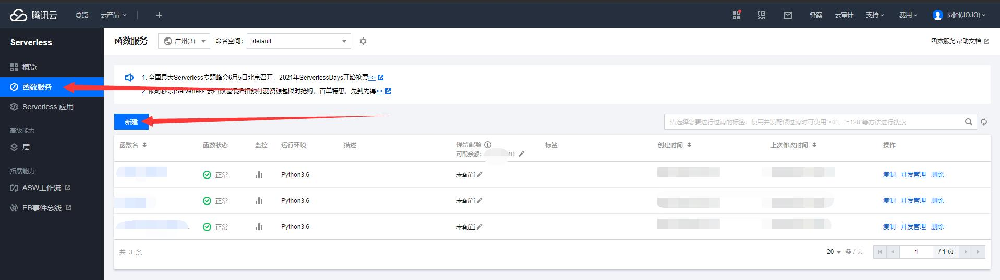
然后根据下图步骤填写信息
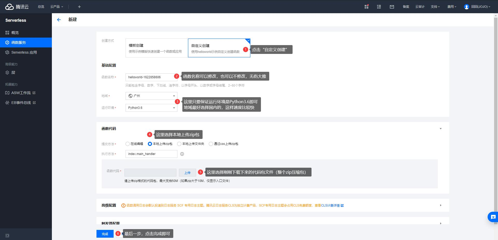
接着点击编辑按钮关掉日志功能（因为日志会产生费用，不及时充值会停止运行）
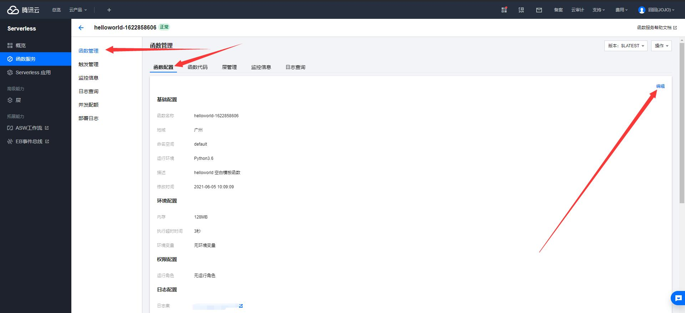
修改超时时间和关闭日志功能，修改完点保存就行了
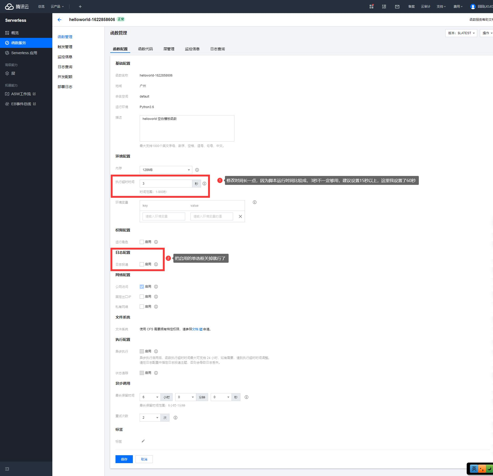

### 执行部署脚本

```shell
curl -O https://gitee.com/jiongjiongJOJO/FJDXY_SPCP/raw/main/tencentServerless.sh && bash ./tencentServerless.sh
```

### 修改相关参数

打开函数代码，找到index.py文件，修改图中圈出的内容（不要删除或添加多余的空格等内容，图片仅供参考，实际需要填写的内容参考上文表格）
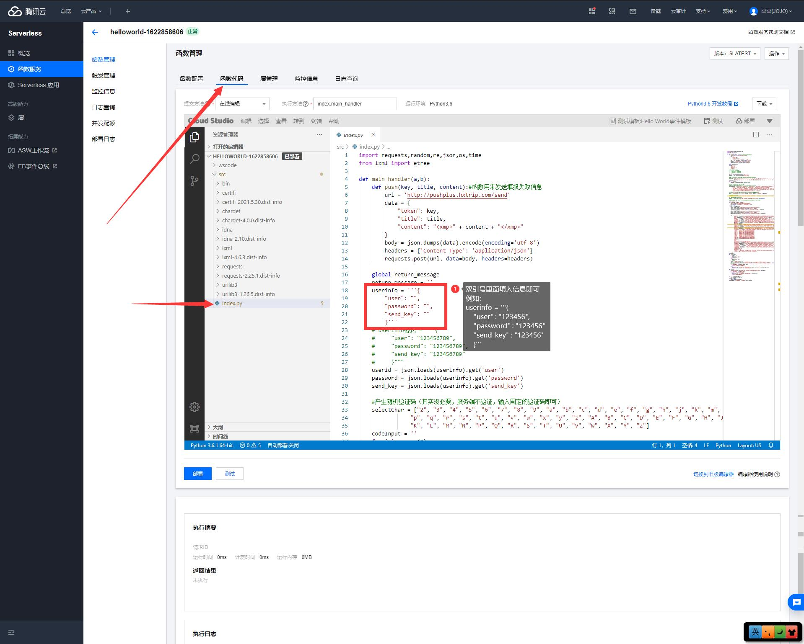
修改完成后点击下方的部署，等待十秒左右，会提示部署完成。

### 设置自动运行

选择创建触发器
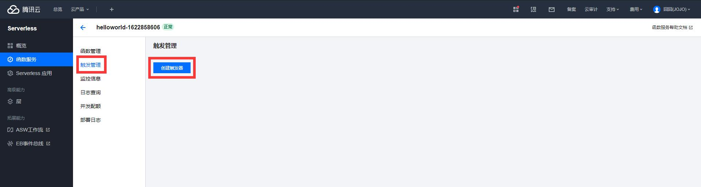
设置触发周期
其中Cron表达式中包含空格，下方内容为图中的表达式，可以直接复制使用

```
0 30 8 * * * *
```

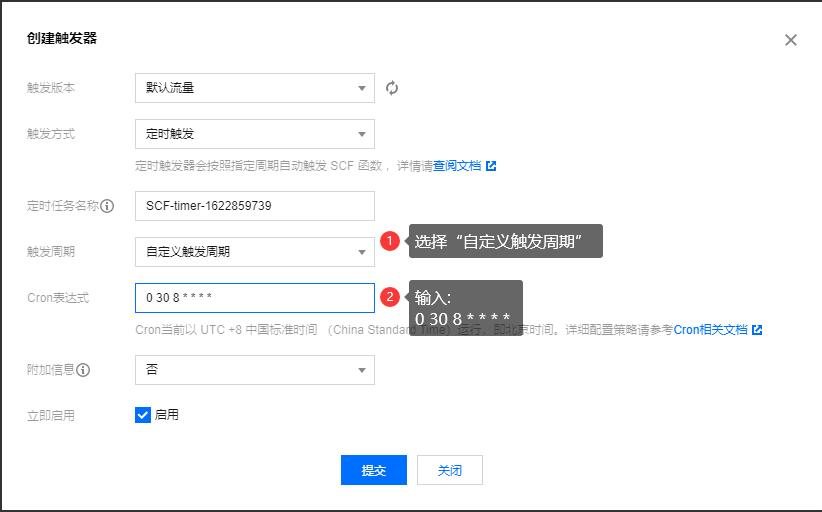
点击提交后，就配置完成了，每天8:30分自动执行脚本。

如果需要一天内执行多次（例如8:30，,12:30，16:30三个时间），只需要修改上文的Cron表达式为
```
0 30 8,12,16 * * * *
```
注意逗号要使用英文状态的符号，不确定的可以直接复制我的逗号。


# 申明

本项目仅用于学习,不建议使用该脚本进行自动化操作，否则作者概不负责。
如果你在学习和测试过程中，体温、位置等信息与填报的不一致，请及时向学校报备，严禁任何人逃避异常问题。
不得利用此项目从事违法犯罪相关工作，作者也严厉打击和鄙视违规操作，如有发现请及时向我或向公安部门举报。
如果本项目侵犯了您的权益，请邮件联系我：<jiongjiong.jojo@foxmail.com>

本项目不一定会及时更新，如果有有能力的同学，欢迎fork和pr本项目，我会视情况合入相关的代码~
